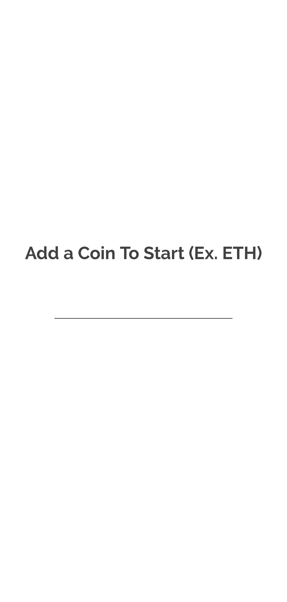
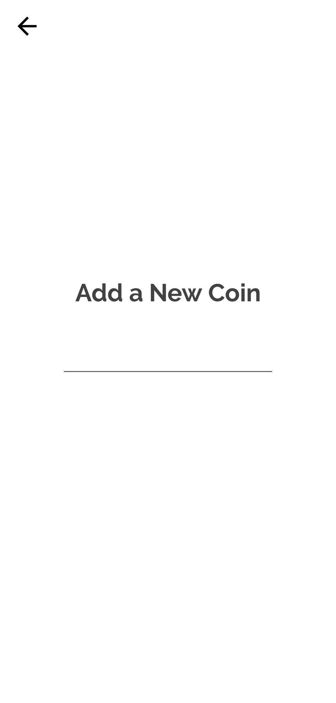
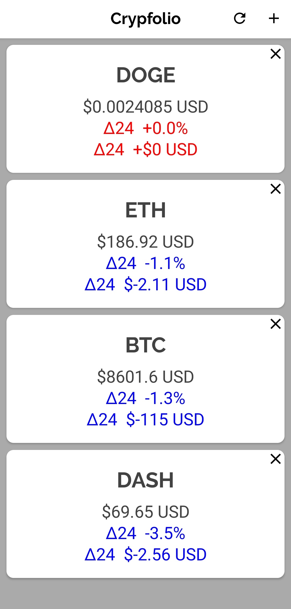
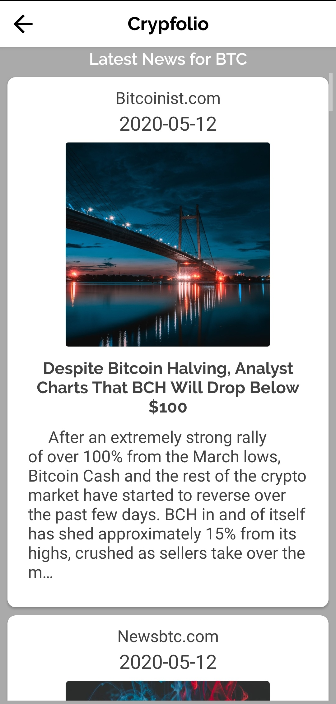

# 

<a href="https://play.google.com/store/apps/details?id=com.kartiksinghal.www.crypfolio"> Download from the Google Play Store </a>

<h5>
  A no-frills crypto tracker, easily add your portfolio and stay updated on the latest price and news updates as soon as they happen.
</h5>
<h4>
Features: 
  </h4>
  <ul>
    <li>
      Latest news aggregated from thousands of sources via the News API
    </li>
  <li>
      Latest price updates provided via the CryptoCompare API
    </li>
  
  <li>
     Track the 24 hour price and percentage deltas of your coins
    </li>
  
  
  </ul>

<h4>Built Using: </h4>
 
  <ul>
    <li>
      Android SDK
    </li>
  <li>
    <a href="http://loopj.com/android-async-http/">Android Asynchronous Http Client</a>
    </li>
  
  <li>
     <a href="https://www.cryptocompare.com/api/#-api-data-price-">CryptoCompare API</a>
    </li>
    <li>
     <a href="https://newsapi.org/docs">News API</a>
    </li>
  
  
  </ul>
  
  <h4> Screenshots: </h4>
  
Start Up Page             |  Add Coin View
:-------------------------:|:-------------------------:
  | 

Dashboard View           |  Crypto View
:-------------------------:|:-------------------------:
 | 

